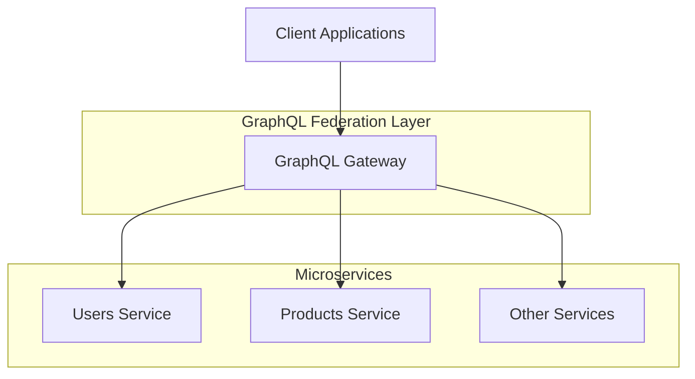

# Architecture Overview

This document explains the architecture of the federated GraphQL project, which combines gRPC microservices with GraphQL federation.

## High-Level Architecture




## Components

### 1. GraphQL Gateway

The gateway provides a unified GraphQL API by federating multiple microservices.

**Key features**:
- Federation support for cross-service entity resolution
- Schema stitching to combine multiple GraphQL schemas
- Query routing to appropriate backend services
- Authentication and authorization

**Technology**:
- gqlgen for generating Go code from GraphQL schemas
- Chi router for HTTP handling
- GraphQL Playground for API exploration

**Location**: `/services/graphql-gateway`

### 2. gRPC Microservices

Independent services that implement specific domain functionality.

**Current services**:
- **Users Service**: User management
- **Products Service**: Product catalog

**Technology**:
- Protocol Buffers for interface definition
- Connect protocol for efficient gRPC communication
- Go standard library HTTP server with h2c

**Locations**:
- `/services/users`
- `/services/product`

### 3. Code Generation Pipeline

A set of tools that generate code from Protocol Buffer definitions.

**Stages**:
- Proto to Go code generation
- Proto to GraphQL schema generation
- GraphQL schema to resolver interface generation

**Technologies**:
- Buf for proto management
- protoc-gen-go for Go code generation
- Custom protoc-gen-graphql for GraphQL schema generation
- gqlgen for GraphQL resolver generation

### 4. Federation Metadata

Protocol Buffer extensions for defining federation concepts.

**Key concepts**:
- Entities: Objects with a unique identity across services
- Keys: Fields that uniquely identify entities
- External fields: Fields defined in other services
- Computed fields: Fields derived from other services

**Location**: `/proto/metadata/v1/metadata.proto`

## Communication Flow

1. **Client to Gateway**:
   - Client sends GraphQL query to the gateway
   - Gateway parses and validates the query

2. **Gateway to Services**:
   - Gateway determines which services can resolve parts of the query
   - Gateway makes Connect/gRPC calls to relevant services

3. **Entity Resolution**:
   - Gateway collects partial results from services
   - Gateway resolves references between entities
   - Gateway assembles complete response

4. **Response to Client**:
   - Gateway formats and returns the unified response

## Data Flow

### Example: Query a User and Their Products

```graphql
{
  user(userID: "alice") {
    userID
    name
    products {
      productID
      name
      price
    }
  }
}
```

**Resolution process**:
1. Gateway receives the query
2. User resolver calls Users Service to get user data
3. Products field resolver calls Products Service with user's ID
4. Gateway combines the results and returns unified response

## Extensibility

The architecture is designed for easy addition of new services:

1. Define a new service in Protocol Buffers
2. Generate Go code and GraphQL schema
3. Implement the gRPC service
4. Implement the GraphQL resolvers
5. Update the Makefile for building and running

## Security Considerations

- **Authentication**: Currently minimal; should be added at the gateway level
- **Authorization**: Not implemented; should be added for production
- **Transport Security**: Uses HTTP/2 without TLS for development

## Performance Characteristics

- **Latency**: Added overhead due to the gateway layer
- **Throughput**: Limited by the slowest service in a query path
- **Caching**: Not implemented; should be added for production

## Deployment Considerations

- **Independence**: Services can be deployed separately
- **Scaling**: Services can scale independently based on demand
- **Discovery**: Currently hardcoded endpoints; should use service discovery in production

## Next Steps

- [Getting Started Guide](./getting-started.md)
- [Adding New Services](./adding-services.md)
- [Code Generation Lifecycle](./code-generation.md)